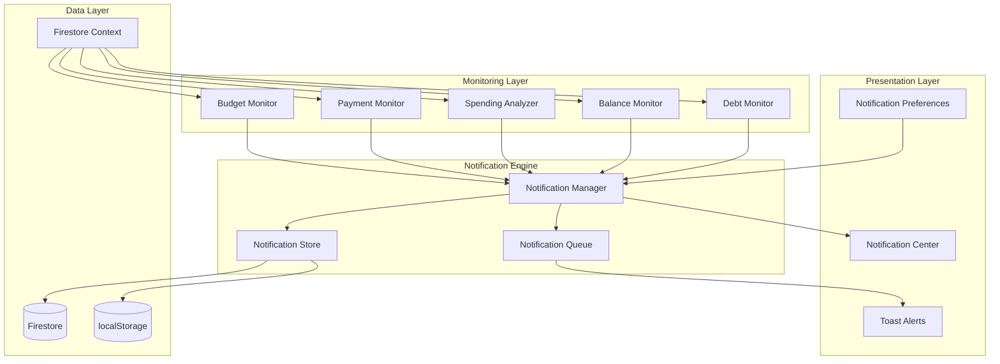

# Design Document: Intelligent Alerts and Notifications System

## Overview

The Intelligent Alerts and Notifications System is a comprehensive monitoring and alerting subsystem for MoneyTrack that proactively notifies users about important financial events. The system consists of three main layers:

1. **Monitoring Layer**: Background services that continuously evaluate financial data against configured thresholds
2. **Notification Engine**: Core logic for generating, storing, and managing notifications
3. **Presentation Layer**: UI components for displaying notifications (Notification Center and toast alerts)

The system integrates seamlessly with MoneyTrack's existing architecture, leveraging Firestore listeners for real-time monitoring and supporting both authenticated (Firestore) and guest (localStorage) modes.

### Key Design Principles

- **Non-intrusive**: Notifications inform without disrupting user workflow
- **Configurable**: Users control what notifications they receive and when
- **Performant**: Efficient algorithms with caching and debouncing to avoid performance degradation
- **Real-time**: Leverages existing Firestore listeners for immediate alert generation
- **Persistent**: Notifications survive across sessions
- **Secure**: Firestore rules ensure users only access their own notifications

## Architecture

### System Components



### Data Flow

1. **Monitoring**: Monitors subscribe to data changes via Firestore Context
2. **Evaluation**: When data changes, monitors evaluate alert conditions
3. **Generation**: If conditions are met, monitors call Notification Manager to create notifications
4. **Storage**: Notification Manager stores notifications in Firestore/localStorage
5. **Display**: Notification Center displays stored notifications; Toast Queue shows immediate alerts
6. **Management**: Users interact with notifications (mark read, clear, filter)

### Integration Points

- **Firestore Context**: Single source of truth for all financial data
- **react-hot-toast**: Existing toast library for immediate alerts
- **useLocalStorage**: Existing hook for guest mode persistence
- **Existing Hooks**: useBudgets, useRecurringPayments, useAccounts, useDebts provide data

## Components and Interfaces

### 1. Notification Data Model

```typescript
interface Notification {
  id: string;
  type: 'budget' | 'recurring' | 'unusual_spending' | 'low_balance' | 'debt' | 'info';
  title: string;
  message: string;
  severity: 'info' | 'warning' | 'error' | 'success';
  isRead: boolean;
  createdAt: Date;
  actionUrl?: string;
  metadata?: NotificationMetadata;
}

interface NotificationMetadata {
  budgetId?: string;
  categoryName?: string;
  recurringPaymentId?: string;
  transactionId?: string;
  accountId?: string;
  debtId?: string;
  percentage?: number;
  amount?: number;
  threshold?: number;
}
```

### 2. Notification Preferences Model

```typescript
interface NotificationPreferences {
  enabled: {
    budget: boolean;
    recurring: boolean;
    unusualSpending: boolean;
    lowBalance: boolean;
    debt: boolean;
  };
  thresholds: {
    budgetWarning: number;      // Default: 80
    budgetCritical: number;     // Default: 90
    budgetExceeded: number;     // Default: 100
    unusualSpending: number;    // Default: 200 (percentage)
    lowBalance: number;         // Default: 100000 COP
  };
  quietHours: {
    enabled: boolean;
    startHour: number;          // 0-23
    endHour: number;            // 0-23
  };
}
```

### 3. Notification Manager (Core Engine)

The Notification Manager is the central orchestrator for all notification operations.

```typescript
interface NotificationManager {
  // Core operations
  createNotification(notification: Omit<Notification, 'id' | 'createdAt'>): Promise<void>;
  markAsRead(notificationId: string): Promise<void>;
  markAllAsRead(): Promise<void>;
  deleteNotification(notificationId: string): Promise<void>;
  clearAll(): Promise<void>;
  
  // Query operations
  getNotifications(filter?: NotificationFilter): Notification[];
  getUnreadCount(): number;
  
  // Preferences
  getPreferences(): NotificationPreferences;
  updatePreferences(updates: Partial<NotificationPreferences>): Promise<void>;
  
  // Internal utilities
  shouldShowToast(notification: Notification): boolean;
  isInQuietHours(): boolean;
  deduplicateNotification(notification: Notification): boolean;
}

interface NotificationFilter {
  type?: Notification['type'];
  isRead?: boolean;
  severity?: Notification['severity'];
}
```

**Implementation Notes**:
- Uses a debounce map to prevent duplicate notifications within 1 second
- Maintains a queue for toast alerts to avoid overwhelming users
- Automatically prunes notifications older than 30 days on initialization
- Limits storage to 100 notifications per user (FIFO deletion)

### 4. Budget Monitor

Monitors budget utilization and generates alerts when thresholds are crossed.

```typescript
interface BudgetMonitor {
  evaluateBudgetAlerts(transaction: Transaction): Promise<void>;
  calculateBudgetUtilization(budgetId: string): BudgetUtilization;
}

interface BudgetUtilization {
  budgetId: string;
  category: string;
  limit: number;
  spent: number;
  percentage: number;
}
```

**Algorithm**:
1. When a transaction is added/modified, check if it's an expense
2. Find all active budgets matching the transaction's category
3. Calculate current month's spending for that category
4. Calculate utilization percentage
5. Check against thresholds (80%, 90%, 100% or custom)
6. If threshold crossed, generate notification with appropriate severity
7. Use debouncing to prevent duplicate alerts

**Caching Strategy**:
- Cache budget utilization calculations for 30 seconds
- Invalidate cache when transactions or budgets change

### 5. Payment Monitor

Monitors recurring payment due dates and generates reminders.

```typescript
interface PaymentMonitor {
  checkUpcomingPayments(): Promise<void>;
  getDaysUntilDue(payment: RecurringPayment): number;
  isAlreadyPaid(payment: RecurringPayment, month: number, year: number): boolean;
}
```

**Algorithm**:
1. Run daily check on app initialization
2. For each active recurring payment:
   - Calculate next due date based on dueDay and frequency
   - Calculate days until due
   - Check if already paid for current period (via linked transactions)
   - If 3 days away and not paid: generate info notification
   - If 1 day away and not paid: generate warning notification
   - If due today and not paid: generate high-priority warning
3. Store last check timestamp to avoid redundant checks

**Due Date Calculation**:
- Monthly: Next occurrence of dueDay in current or next month
- Yearly: Next occurrence of dueDay in current or next year
- Handle edge cases (e.g., dueDay=31 in February → use last day of month)

### 6. Spending Analyzer

Detects unusual spending patterns by comparing transactions to historical averages.

```typescript
interface SpendingAnalyzer {
  evaluateUnusualSpending(transaction: Transaction): Promise<void>;
  calculateCategoryAverage(category: string, days: number): number;
  hasMinimumHistory(category: string): boolean;
}
```

**Algorithm**:
1. When an expense transaction is added, check if it's paid
2. Calculate 3-month average for the transaction's category
3. Require minimum 3 historical transactions for comparison
4. If transaction amount > (average × threshold percentage):
   - Generate warning notification
   - Include transaction details and average in metadata
5. Use caching to avoid recalculating averages repeatedly

**Caching Strategy**:
- Cache category averages for 5 minutes
- Invalidate cache when new transactions are added to a category

### 7. Balance Monitor

Monitors account balances and alerts when they drop below thresholds.

```typescript
interface BalanceMonitor {
  evaluateBalanceAlerts(accountId: string): Promise<void>;
  getAccountBalance(accountId: string): number;
  getBalanceThreshold(account: Account): number;
}
```

**Algorithm**:
1. When a transaction affects an account, recalculate balance
2. Use existing BalanceCalculator.calculateAccountBalance()
3. Compare balance to threshold:
   - Savings/Cash: Default 100,000 COP or custom
   - Credit: Default 0 COP (available credit exhausted)
4. If balance < threshold: generate warning notification
5. Implement 24-hour cooldown to prevent spam

**Cooldown Implementation**:
- Store last alert timestamp per account in memory
- Skip alert if last alert was within 24 hours
- Reset cooldown when balance rises above threshold

### 8. Debt Monitor

Monitors unsettled debts and generates periodic reminders.

```typescript
interface DebtMonitor {
  checkOverdueDebts(): Promise<void>;
  getDaysOutstanding(debt: Debt): number;
}
```

**Algorithm**:
1. Run daily check on app initialization
2. For each unsettled debt:
   - Calculate days since creation
   - For borrowed debts:
     - 30 days: info notification
     - 60 days: warning notification
   - For lent debts:
     - 90 days: info notification
3. Store last reminder date to avoid daily spam (remind weekly after initial alert)

### 9. Notification Center Component

React component for displaying and managing notifications.

```typescript
interface NotificationCenterProps {
  isOpen: boolean;
  onClose: () => void;
}

interface NotificationCenterState {
  notifications: Notification[];
  filter: NotificationFilter;
  unreadCount: number;
}
```

**UI Structure**:
```
┌─────────────────────────────────┐
│ Notifications          [X]      │
├─────────────────────────────────┤
│ [All] [Budget] [Payments] ...   │ ← Filter tabs
├─────────────────────────────────┤
│ ● Budget Alert                  │ ← Unread indicator
│   You've reached 85% of your    │
│   Groceries budget              │
│   2 hours ago        [View] →   │
├─────────────────────────────────┤
│   Payment Reminder              │ ← Read (no dot)
│   Netflix payment due tomorrow  │
│   1 day ago          [View] →   │
├─────────────────────────────────┤
│ [Mark all read] [Clear all]     │
└─────────────────────────────────┘
```

**Features**:
- Dropdown panel triggered by bell icon in header
- Badge showing unread count
- Filter tabs for notification types
- Color-coded severity indicators
- Clickable action buttons that navigate to relevant views
- Empty state when no notifications
- Smooth animations (slide-in/fade)

### 10. Notification Preferences Component

Settings panel for configuring notification behavior.

```typescript
interface NotificationPreferencesProps {
  preferences: NotificationPreferences;
  onUpdate: (updates: Partial<NotificationPreferences>) => Promise<void>;
}
```

**UI Structure**:
```
┌─────────────────────────────────┐
│ Notification Settings           │
├─────────────────────────────────┤
│ Notification Types              │
│ ☑ Budget Alerts                 │
│ ☑ Payment Reminders             │
│ ☑ Unusual Spending              │
│ ☑ Low Balance Warnings          │
│ ☑ Debt Reminders                │
├─────────────────────────────────┤
│ Thresholds                      │
│ Budget Warning:    [80] %       │
│ Budget Critical:   [90] %       │
│ Unusual Spending:  [200] %      │
│ Low Balance:       [100000] COP │
├─────────────────────────────────┤
│ Quiet Hours                     │
│ ☐ Enable quiet hours            │
│ From: [22:00] To: [08:00]       │
└─────────────────────────────────┘
```

### 11. Toast Alert Integration

Leverages existing react-hot-toast for immediate notifications.

```typescript
interface ToastManager {
  showToast(notification: Notification): void;
  queueToast(notification: Notification): void;
}
```

**Toast Display Rules**:
- Only show toasts for high-priority notifications (warning, error severity)
- Respect quiet hours setting
- Queue multiple toasts to avoid overwhelming (max 3 visible at once)
- Auto-dismiss after 5 seconds
- Color-coded by severity:
  - Info: Blue
  - Warning: Yellow
  - Error: Red
  - Success: Green

### 12. Custom Hook: useNotifications

Main hook for consuming notification functionality.

```typescript
function useNotifications(userId: string | null) {
  const notifications: Notification[];
  const unreadCount: number;
  const loading: boolean;
  const preferences: NotificationPreferences;
  
  // Operations
  const markAsRead: (id: string) => Promise<void>;
  const markAllAsRead: () => Promise<void>;
  const deleteNotification: (id: string) => Promise<void>;
  const clearAll: () => Promise<void>;
  const updatePreferences: (updates: Partial<NotificationPreferences>) => Promise<void>;
  
  // Filters
  const getFilteredNotifications: (filter: NotificationFilter) => Notification[];
  
  return {
    notifications,
    unreadCount,
    loading,
    preferences,
    markAsRead,
    markAllAsRead,
    deleteNotification,
    clearAll,
    updatePreferences,
    getFilteredNotifications,
  };
}
```

**Implementation**:
- Subscribes to Firestore notifications collection (or reads from localStorage)
- Provides CRUD operations
- Manages preferences
- Handles real-time updates

### 13. Custom Hook: useNotificationMonitoring

Hook that orchestrates all monitoring services.

```typescript
function useNotificationMonitoring(
  userId: string | null,
  transactions: Transaction[],
  budgets: Budget[],
  recurringPayments: RecurringPayment[],
  accounts: Account[],
  debts: Debt[]
) {
  // Initializes all monitors
  // Sets up listeners for data changes
  // Triggers evaluations when data changes
  // Handles daily checks on mount
}
```

**Lifecycle**:
1. On mount: Run daily checks (payments, debts)
2. On transaction change: Evaluate budget, unusual spending, balance alerts
3. On budget change: Re-evaluate budget alerts
4. On recurring payment change: Re-evaluate payment reminders
5. On debt change: Re-evaluate debt reminders

## Data Models

### Firestore Schema

```
users/{userId}/
  ├── notifications/{notificationId}
  │   ├── type: string
  │   ├── title: string
  │   ├── message: string
  │   ├── severity: string
  │   ├── isRead: boolean
  │   ├── createdAt: timestamp
  │   ├── actionUrl?: string
  │   └── metadata?: map
  │
  └── notificationPreferences (single document)
      ├── enabled: map
      ├── thresholds: map
      └── quietHours: map
```

### localStorage Schema (Guest Mode)

```typescript
// Key: 'notifications'
{
  notifications: Notification[];
  preferences: NotificationPreferences;
  lastDailyCheck: string; // ISO timestamp
}
```

### In-Memory State

```typescript
// Debounce map for preventing duplicates
const notificationDebounce = new Map<string, number>();

// Balance alert cooldown
const balanceAlertCooldown = new Map<string, number>();

// Category average cache
const categoryAverageCache = new Map<string, {
  average: number;
  timestamp: number;
}>();

// Budget utilization cache
const budgetUtilizationCache = new Map<string, {
  utilization: BudgetUtilization;
  timestamp: number;
}>();
```


## Correctness Properties

*A property is a characteristic or behavior that should hold true across all valid executions of a system—essentially, a formal statement about what the system should do. Properties serve as the bridge between human-readable specifications and machine-verifiable correctness guarantees.*

### Budget Monitoring Properties

**Property 1: Budget threshold alerts are generated at configured percentages**

*For any* budget and transaction that causes utilization to cross a configured threshold (80%, 90%, or 100%), the Budget_Monitor should generate a notification with severity matching the threshold level (warning at 80%, warning at 90%, error at 100%).

**Validates: Requirements 1.1, 1.2, 1.3**

**Property 2: Budget utilization calculation includes only relevant transactions**

*For any* budget and set of transactions, the calculated utilization should include only expense transactions matching the budget's category within the current calendar month.

**Validates: Requirements 1.4**

**Property 3: Custom budget thresholds override defaults**

*For any* budget with custom threshold preferences configured, the Budget_Monitor should use the custom threshold percentages instead of default values when evaluating alerts.

**Validates: Requirements 1.5, 3.4**

### Recurring Payment Properties

**Property 4: Payment reminders are generated at appropriate intervals**

*For any* active recurring payment, the Payment_Monitor should generate notifications at the correct intervals before the due date (info at 3 days, warning at 1 day, high-priority warning on due date) only if the payment has not been marked as paid for the current period.

**Validates: Requirements 2.1, 2.2, 2.3, 2.5**

**Property 5: Only active payments generate reminders**

*For any* set of recurring payments, the Payment_Monitor should only evaluate and generate reminders for payments where isActive is true.

**Validates: Requirements 2.4**

### Unusual Spending Properties

**Property 6: Unusual spending alerts are generated when threshold exceeded**

*For any* expense transaction in a category with at least 3 historical transactions, if the transaction amount exceeds the configured percentage (default 200%) of the category's 3-month average, the Spending_Analyzer should generate a warning notification.

**Validates: Requirements 3.1, 3.4**

**Property 7: Category average calculation filters correctly**

*For any* category, the calculated 3-month average should include only paid expense transactions from the past 90 days.

**Validates: Requirements 3.2**

### Balance Monitoring Properties

**Property 8: Low balance alerts are generated when threshold crossed**

*For any* account and transaction that causes the account balance to drop below the configured threshold, the Balance_Monitor should generate a warning notification, but not more than once per 24-hour period for the same account.

**Validates: Requirements 4.1, 4.4**

**Property 9: Balance calculation consistency**

*For any* account and set of transactions, the balance calculated by Balance_Monitor should equal the balance calculated by the accounts display logic.

**Validates: Requirements 4.2**

**Property 10: Default balance thresholds vary by account type**

*For any* account without a custom threshold configured, the Balance_Monitor should use 100,000 COP for savings/cash accounts and 0 COP for credit accounts.

**Validates: Requirements 4.3**

### Debt Monitoring Properties

**Property 11: Debt reminders are generated at appropriate intervals**

*For any* unsettled debt, the Notification_Engine should generate reminders at the correct intervals based on debt type (borrowed: info at 30 days, warning at 60 days; lent: info at 90 days).

**Validates: Requirements 5.1, 5.2, 5.3**

**Property 12: Settled debts do not generate reminders**

*For any* debt where isSettled is true, the Notification_Engine should not generate any reminders.

**Validates: Requirements 5.4**

### Notification Display Properties

**Property 13: Notifications are displayed in reverse chronological order**

*For any* set of notifications, when displayed in the Notification_Center, they should be sorted by createdAt timestamp in descending order (newest first).

**Validates: Requirements 6.1**

**Property 14: Notification display includes all required fields**

*For any* notification displayed in the Notification_Center, the rendered output should include the title, message, timestamp, and severity indicator.

**Validates: Requirements 6.2**

**Property 15: Action buttons appear only when actionUrl is present**

*For any* notification, the Notification_Center should display a clickable action button if and only if the notification has an actionUrl defined.

**Validates: Requirements 6.3**

**Property 16: Unread badge count reflects unread notifications**

*For any* set of notifications, the badge count displayed on the bell icon should equal the number of notifications where isRead is false.

**Validates: Requirements 6.4**

### Notification Management Properties

**Property 17: Notification read state updates correctly**

*For any* notification, when marked as read (individually or via mark all as read), the isRead field should be set to true and the unread badge count should update immediately.

**Validates: Requirements 7.1, 7.2, 7.5**

**Property 18: Clear all deletes all notifications**

*For any* set of notifications, when clear all is invoked, all notifications should be deleted from storage.

**Validates: Requirements 7.3**

**Property 19: Notification filtering works correctly**

*For any* notification type filter, the Notification_Center should display only notifications where the type field matches the selected filter.

**Validates: Requirements 7.4**

### Notification Preferences Properties

**Property 20: Disabled notification types are not generated**

*For any* notification type where the enabled preference is false, the Notification_Engine should not generate notifications of that type.

**Validates: Requirements 8.2**

**Property 21: Updated thresholds are applied to future alerts**

*For any* threshold preference update, subsequent alert evaluations should use the new threshold values.

**Validates: Requirements 8.4**

**Property 22: Quiet hours suppress toasts but store notifications**

*For any* notification generated during configured quiet hours, the Notification_System should not display a toast alert but should still store the notification in the Notification_Center.

**Validates: Requirements 8.5, 10.5**

### Notification Persistence Properties

**Property 23: Notifications are stored in the correct location based on auth state**

*For any* notification, if the user is authenticated, it should be stored in Firestore under the user's document; if the user is in guest mode, it should be stored in browser localStorage.

**Validates: Requirements 9.1, 9.2**

**Property 24: Stored notifications are loaded on app initialization**

*For any* set of stored notifications, when the app loads, all notifications should be retrieved and displayed in the Notification_Center.

**Validates: Requirements 9.3**

**Property 25: Old notifications are automatically pruned**

*For any* notification older than 30 days, it should be automatically deleted during app initialization.

**Validates: Requirements 9.4**

### Toast Alert Properties

**Property 26: High-priority notifications trigger toast alerts**

*For any* notification with warning or error severity, the Notification_System should display a toast alert using react-hot-toast (unless quiet hours are active).

**Validates: Requirements 10.1**

**Property 27: Toast alerts use severity-based color coding**

*For any* toast alert, the color should correspond to the notification severity (info: blue, warning: yellow, error: red, success: green).

**Validates: Requirements 10.2**

**Property 28: Toast alerts auto-dismiss after 5 seconds**

*For any* toast alert displayed, it should automatically dismiss after 5 seconds.

**Validates: Requirements 10.3**

**Property 29: Multiple toasts are queued to avoid overwhelming**

*For any* set of notifications generated simultaneously, toast alerts should be queued such that no more than 3 are visible at once.

**Validates: Requirements 10.4**

### Real-time Monitoring Properties

**Property 30: Transaction changes trigger immediate evaluation**

*For any* transaction addition or modification, the Notification_Engine should immediately evaluate budget, unusual spending, and balance alert conditions.

**Validates: Requirements 11.1**

**Property 31: Daily checks run on app initialization**

*For any* app initialization, the Notification_Engine should perform checks for recurring payment reminders and debt reminders.

**Validates: Requirements 11.2**

**Property 32: Debouncing prevents duplicate notifications**

*For any* alert condition evaluated multiple times within 1 second, only one notification should be generated.

**Validates: Requirements 11.3**

**Property 33: Firestore listener changes trigger re-evaluation**

*For any* Firestore listener data change event, the Notification_Engine should re-evaluate relevant alert conditions.

**Validates: Requirements 11.4**

### Performance Properties

**Property 34: Category averages are cached**

*For any* category average calculation, if the same category is queried again within 5 minutes, the cached result should be returned without recalculation.

**Validates: Requirements 12.2**

**Property 35: Notification storage is limited to 100 per user**

*For any* user, the total number of stored notifications should never exceed 100, with oldest notifications deleted first when the limit is reached.

**Validates: Requirements 12.3, 12.4**

### Notification Metadata Properties

**Property 36: Notifications include appropriate metadata**

*For any* notification generated, it should include relevant metadata fields based on its type (budgetId and categoryName for budget alerts, recurringPaymentId for payment reminders, transactionId for unusual spending, accountId for balance warnings, debtId for debt reminders).

**Validates: Requirements 14.1, 14.2, 14.3, 14.4**

**Property 37: Notifications with metadata include actionUrl**

*For any* notification that includes metadata, it should also include an actionUrl that navigates to the relevant view.

**Validates: Requirements 14.5**

## Error Handling

### Notification Generation Errors

**Scenario**: Monitor fails to evaluate alert condition due to invalid data

**Handling**:
- Log error with context (monitor type, data that caused failure)
- Do not generate notification (fail silently to user)
- Continue monitoring other conditions
- Use try-catch blocks around all monitor evaluation logic

**Example**:
```typescript
try {
  await budgetMonitor.evaluateBudgetAlerts(transaction);
} catch (error) {
  logger.error('Budget monitor evaluation failed', { transaction, error });
  // Continue execution - don't block other monitors
}
```

### Storage Errors

**Scenario**: Failed to write notification to Firestore or localStorage

**Handling**:
- Retry once with exponential backoff
- If retry fails, log error but don't show error to user
- For Firestore: Check network connectivity first
- For localStorage: Check quota exceeded error

**Example**:
```typescript
try {
  await saveNotification(notification);
} catch (error) {
  if (error.code === 'quota-exceeded') {
    // Clear old notifications and retry
    await pruneOldNotifications();
    await saveNotification(notification);
  } else {
    logger.error('Failed to save notification', { notification, error });
  }
}
```

### Retrieval Errors

**Scenario**: Failed to load notifications on app initialization

**Handling**:
- Show empty notification center (don't block app)
- Log error for debugging
- Display error message in notification center: "Failed to load notifications"
- Provide retry button

### Calculation Errors

**Scenario**: Invalid data causes calculation to fail (e.g., NaN, undefined)

**Handling**:
- Validate inputs before calculation
- Use default values for missing data
- Log warning if data is unexpected
- Skip alert generation if calculation fails

**Example**:
```typescript
function calculateBudgetUtilization(budget: Budget, transactions: Transaction[]): number {
  if (!budget?.monthlyLimit || budget.monthlyLimit <= 0) {
    logger.warn('Invalid budget limit', { budget });
    return 0;
  }
  
  const spent = transactions
    .filter(t => t.amount && !isNaN(t.amount))
    .reduce((sum, t) => sum + t.amount, 0);
  
  return (spent / budget.monthlyLimit) * 100;
}
```

### Toast Display Errors

**Scenario**: react-hot-toast fails to display toast

**Handling**:
- Catch error and log it
- Notification is still stored in center (user can see it there)
- Don't retry toast display (avoid spam)

### Preference Update Errors

**Scenario**: Failed to save preference changes

**Handling**:
- Show error toast to user: "Failed to save preferences"
- Revert UI to previous state
- Provide retry button
- Log error with details

## Testing Strategy

The Intelligent Alerts and Notifications System requires comprehensive testing using both property-based tests and unit tests to ensure correctness, reliability, and performance.

### Property-Based Testing

Property-based tests validate universal properties across all inputs using randomized test data. Each property test should:

- Run a minimum of 100 iterations
- Generate random but valid test data
- Reference the design document property it validates
- Use the tag format: **Feature: intelligent-alerts-notifications, Property {number}: {property_text}**

**Testing Library**: Use `fast-check` for TypeScript property-based testing

**Example Property Test**:
```typescript
import fc from 'fast-check';

// Feature: intelligent-alerts-notifications, Property 2: Budget utilization calculation includes only relevant transactions
test('budget utilization includes only relevant transactions', () => {
  fc.assert(
    fc.property(
      fc.record({
        budget: budgetArbitrary(),
        transactions: fc.array(transactionArbitrary()),
      }),
      ({ budget, transactions }) => {
        const utilization = calculateBudgetUtilization(budget, transactions);
        
        // Manually calculate expected utilization
        const now = new Date();
        const relevantTransactions = transactions.filter(t => {
          const tDate = new Date(t.date);
          return (
            t.type === 'expense' &&
            t.paid &&
            t.category === budget.category &&
            tDate.getMonth() === now.getMonth() &&
            tDate.getFullYear() === now.getFullYear()
          );
        });
        
        const expectedSpent = relevantTransactions.reduce((sum, t) => sum + t.amount, 0);
        const expectedUtilization = (expectedSpent / budget.monthlyLimit) * 100;
        
        expect(utilization.percentage).toBeCloseTo(expectedUtilization, 2);
      }
    ),
    { numRuns: 100 }
  );
});
```

**Arbitraries to Implement**:
- `budgetArbitrary()`: Generates random valid budgets
- `transactionArbitrary()`: Generates random valid transactions
- `recurringPaymentArbitrary()`: Generates random recurring payments
- `accountArbitrary()`: Generates random accounts
- `debtArbitrary()`: Generates random debts
- `notificationArbitrary()`: Generates random notifications
- `preferencesArbitrary()`: Generates random notification preferences

### Unit Testing

Unit tests validate specific examples, edge cases, and integration points. Focus areas:

**1. Edge Cases**
- Categories with fewer than 3 transactions (no unusual spending alerts)
- Empty notification center display
- Notifications exactly at 30-day boundary
- Due dates on invalid days (e.g., February 31 → February 28/29)
- Zero or negative balances
- Exactly 100 notifications (boundary of limit)

**2. Integration Points**
- Firestore listener integration with monitors
- Toast display integration with react-hot-toast
- Navigation integration with actionUrl clicks
- Preference updates propagating to monitors

**3. Error Conditions**
- Invalid transaction data
- Missing required fields
- Storage quota exceeded
- Network failures (Firestore)
- Calculation errors (NaN, undefined)

**4. Specific Examples**
- Empty notification center shows empty state message
- Notification preferences UI displays all expected controls
- Threshold configuration inputs are present

**Example Unit Test**:
```typescript
describe('Budget Monitor', () => {
  it('should not generate alerts for categories with fewer than 3 transactions', async () => {
    const budget = createBudget({ category: 'Groceries', monthlyLimit: 100000 });
    const transactions = [
      createTransaction({ category: 'Groceries', amount: 50000 }),
      createTransaction({ category: 'Groceries', amount: 60000 }),
    ];
    
    const notifications: Notification[] = [];
    const mockNotificationManager = {
      createNotification: jest.fn((n) => notifications.push(n)),
    };
    
    const monitor = new BudgetMonitor(mockNotificationManager);
    await monitor.evaluateBudgetAlerts(transactions[1]);
    
    // Should generate alert (110% of budget)
    expect(notifications).toHaveLength(1);
    
    // But if we check unusual spending with only 2 transactions, no alert
    const spendingAnalyzer = new SpendingAnalyzer(mockNotificationManager);
    const unusualTransaction = createTransaction({ category: 'Groceries', amount: 200000 });
    await spendingAnalyzer.evaluateUnusualSpending(unusualTransaction);
    
    // Still only 1 notification (budget alert, no unusual spending alert)
    expect(notifications).toHaveLength(1);
  });
});
```

### Test Coverage Goals

- **Property Tests**: Cover all 37 correctness properties
- **Unit Tests**: Cover all edge cases, error conditions, and integration points
- **Code Coverage**: Aim for 90%+ coverage of notification system code
- **Integration Tests**: Test end-to-end flows (transaction → alert → display)

### Testing Best Practices

1. **Isolation**: Mock external dependencies (Firestore, localStorage, toast library)
2. **Time Control**: Use fake timers for testing time-based logic (cooldowns, auto-dismiss)
3. **Determinism**: Seed random generators for reproducible tests
4. **Fast Execution**: Property tests should complete in < 5 seconds
5. **Clear Failures**: Test failures should clearly indicate which property was violated
6. **Comprehensive Arbitraries**: Ensure arbitraries generate edge cases (empty arrays, boundary values, etc.)

### Manual Testing Checklist

While automated tests cover correctness, some aspects require manual verification:

- [ ] Visual appearance of notifications in light/dark mode
- [ ] Notification center animations and transitions
- [ ] Toast positioning and stacking behavior
- [ ] Responsive design on mobile devices
- [ ] Accessibility (keyboard navigation, screen readers)
- [ ] Performance with 100 notifications
- [ ] Network resilience (offline → online transitions)
